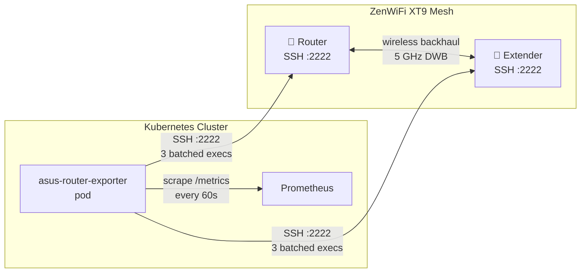

# asuszenwifixt9-monitoring

Prometheus exporter for the **ASUS ZenWiFi XT9** mesh network.  
Connects to the router and extender via SSH, parses Broadcom `wl` and `/proc` data, and exposes ~40 metrics for scraping by kube-prometheus-stack.

## Why does this exist?

ASUS provides no native metrics export for the ZenWiFi XT9. There's no Prometheus endpoint, no SNMP, no API — nothing. If you want visibility into your mesh network you're on your own.

What ASUS *does* allow is SSH access into the devices. So this exporter SSHes into each node, manually scrapes every useful data source available (`/proc`, `/sys`, `wl`, `dnsmasq.leases`), and turns it all into proper labeled Prometheus metrics. It's not elegant, but it works, and it gives you far more per-client detail than most dedicated network monitoring tools.

---

## Architecture



Each scrape performs **3 batched SSH exec calls per node** to minimise connection overhead:

1. **System batch** — `/proc/loadavg`, `/proc/uptime`, `/proc/meminfo`, `/proc/stat`, thermal zone, `/proc/net/dev`, DHCP leases
2. **WiFi radio batch** — `wl assoclist`, `wl status`, `wl chanim_stats` for every radio (eth4/eth5/eth6), all in one exec
3. **Per-client sta_info batch** — all `wl sta_info <MAC>` calls for all radios in one exec

---

## Metrics

| Metric | Type | Description |
|--------|------|-------------|
| `asus_router_uptime_seconds` | Gauge | Node uptime |
| `asus_router_load_{1,5,15}m` | Gauge | Load average |
| `asus_router_memory_{total,free,available,cached,buffers}_bytes` | Gauge | RAM |
| `asus_router_temperature_celsius` | Gauge | Board temperature |
| `asus_router_cpu_seconds_total` | Counter | CPU jiffies by mode |
| `asus_router_dhcp_leases_total` | Gauge | Active DHCP leases (router only) |
| `asus_router_interface_{rx,tx}_bytes_total` | Counter | Interface traffic |
| `asus_router_interface_{rx,tx}_packets_total` | Counter | Interface packets |
| `asus_router_interface_{rx,tx}_{errors,drops}_total` | Counter | Interface errors/drops |
| `asus_router_wifi_clients` | Gauge | Associated clients per radio (excl. backhaul) |
| `asus_router_wifi_channel_utilization_percent` | Gauge | Channel util by type (tx/inbss/obss/idle/busy/qbss) |
| `asus_router_wifi_noise_dbm` | Gauge | Radio noise floor |
| `asus_router_wifi_channel_{goodtx,badtx,glitch}_total` | Counter | Channel frame counters |
| `asus_router_backhaul_{rssi_dbm,snr_db}` | Gauge | Backhaul link quality (extender only) |
| `asus_router_wifi_client_rssi_dbm` | Gauge | Per-client RSSI |
| `asus_router_wifi_client_{tx,rx}_bytes_total` | Counter | Per-client bytes |
| `asus_router_wifi_client_{tx,rx}_rate_kbps` | Gauge | Per-client PHY rate |
| `asus_router_wifi_client_tx_failures_total` | Counter | Per-client TX failures |
| `asus_router_wifi_client_idle_seconds` | Gauge | Per-client idle time |
| `asus_router_scrape_duration_seconds` | Gauge | Time taken for one full scrape |

Labels: most metrics carry `node` (`router` or `extender`). WiFi metrics carry `radio` (e.g. `eth4`) and `band` (e.g. `2.4GHz`). Per-client metrics also carry `mac` and `hostname` (resolved from DHCP leases).

---

## Project layout

```
.
├── collector/
│   ├── __init__.py
│   ├── config.py        # env-var configuration + static interface/MAC lists
│   ├── ssh_client.py    # paramiko wrapper with auto-reconnect
│   ├── parsers.py       # pure parsing functions (no side effects)
│   ├── collector.py     # RouterCollector (prometheus_client custom Collector)
│   └── main.py          # entry point — registers collector, starts HTTP server
├── Dockerfile
├── requirements.txt
├── k8s/
│   ├── namespace.yml
│   ├── secret.yml.template   # copy → secret.yml, fill password, apply, delete
│   ├── deployment.yml
│   ├── service.yml
│   └── servicemonitor.yml
└── .github/workflows/build.yml   # builds + pushes to ghcr.io on push to main
```

---

## Configuration

All settings are environment variables with sensible defaults:

| Variable | Default | Description |
|----------|---------|-------------|
| `ROUTER_SSH_HOST` | _(required)_ | Router IP address |
| `ROUTER_SSH_PORT` | `2222` | Router SSH port |
| `EXTENDER_SSH_HOST` | _(required)_ | Extender IP address |
| `EXTENDER_SSH_PORT` | `2222` | Extender SSH port |
| `SSH_USERNAME` | `router` | SSH username |
| `SSH_PASSWORD` | _(empty)_ | SSH password — set from Secret |
| `METRICS_PORT` | `9100` | HTTP port for `/metrics` |
| `LOG_LEVEL` | `INFO` | Python log level |

---

## Deployment

The deployment uses:
- A **ConfigMap** (`asus-router-exporter-config`) for non-sensitive config: router IPs, ports, log level
- A **Secret** (`router-ssh-credentials`) for SSH credentials

Both are loaded into the pod via `envFrom`, so the Deployment manifest contains no hardcoded values. Ansible creates/manages these objects at deploy time.

### 1. Create the ConfigMap

```bash
cp k8s/configmap.yml.template k8s/configmap.yml
# Edit k8s/configmap.yml with your router IPs
kubectl apply -f k8s/configmap.yml
rm k8s/configmap.yml
```

### 2. Create the Secret

```bash
cp k8s/secret.yml.template k8s/secret.yml
# Edit k8s/secret.yml and set the real password
kubectl apply -f k8s/secret.yml
rm k8s/secret.yml   # don't commit the real secret
```

### 3. Apply the remaining manifests

```bash
kubectl apply -f k8s/namespace.yml
kubectl apply -f k8s/deployment.yml
kubectl apply -f k8s/service.yml
kubectl apply -f k8s/servicemonitor.yml
```

### 4. Verify

```bash
kubectl -n asus-monitoring get pods
kubectl -n asus-monitoring logs -l app=asus-router-exporter -f
```

---

## Local development

```bash
pip install -r requirements.txt
export SSH_PASSWORD=yourpassword
python -m collector.main
curl http://localhost:9100/metrics | grep asus_router
```

---

## Image

Built automatically on push to `main` and published to:

```
ghcr.io/wheetazlab/asuszenwifixt9-monitoring:latest
```

